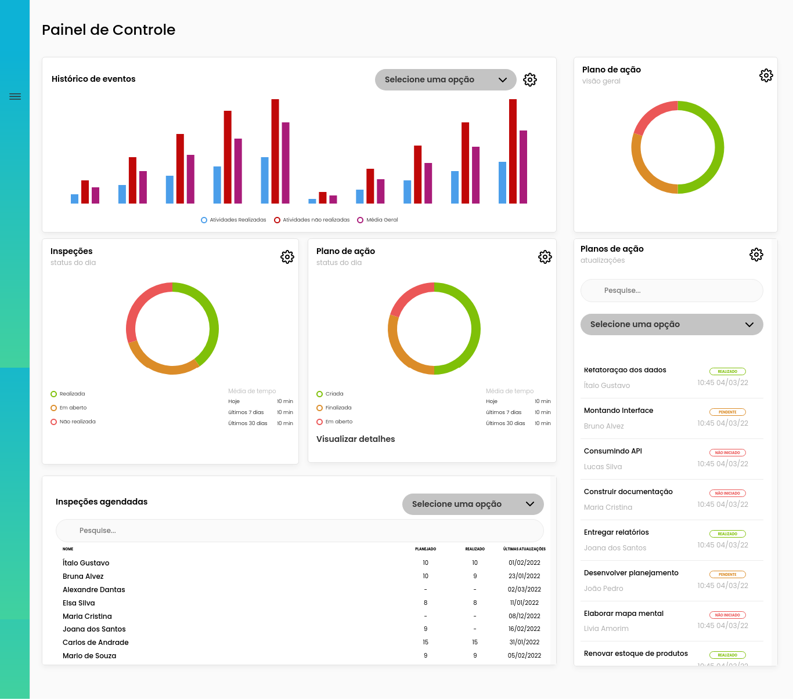

<p align="center">
    <a href="#-projeto">🖥 Projeto</a>&nbsp;&nbsp;&nbsp;|&nbsp;&nbsp;&nbsp;
    <a href="#-projeto">🎨 Layout</a>&nbsp;&nbsp;&nbsp;|&nbsp;&nbsp;&nbsp;
    <a href="#-tecnologias">👨‍💻 Tecnologias</a>&nbsp;&nbsp;&nbsp;|&nbsp;&nbsp;&nbsp;
    <a href="#-executar-o-projeto">🖇 Execução do Projeto</a>&nbsp;&nbsp;&nbsp;|&nbsp;&nbsp;&nbsp;
    <a href="#-licença">📃 Licença</a>&nbsp;&nbsp;&nbsp;|&nbsp;&nbsp;&nbsp;
    <a href="#-observações">📌 Observações</a>
</p>
<div style="display: flex; flex-direction: row; justify-content: center; align-items: center; flex-wrap: wrap"  align="center">
    
</div>


## 🖥 Projeto
O **Dashboard Teste** é um projeto desenvolvido como teste para estágio. Foram usadas abordagens diferentes no seu desenvolvimento, desde a renderização dos dados, até a criação de componentes. Usando como base o boilerplate gerado pelo Vite

## 👨‍💻 Tecnologias
As tecnologias usadas nesse projeto foram:
- [Vite](https://vitejs.dev/)
- [React](https://reactjs.org/)
- [Typescript](https://www.typescript.org/)
- [Styled-Components](https://styled-components.com/)
- [axios](https://axios-http.com/)
- [json-server](https://www.npmjs.com/package/json-server)
- [nivo](https://nivo.rocks/)


## 🎨 Layout
Link para o design do projeto: [Dashboard-Teste](https://www.figma.com/file/Q00anRWTKTzdT4PY63z6FI/DashboardTeste-(Copy)?node-id=2%3A19)


## 🖇 Executar o Projeto
Para executar o projeto, siga dos seguintes passos:

- Clone o repositório
    ```bash
    $ git clone https://github.com/Yta-ux/dashboard-test.git
    ```
- Entre no repositório
    ```bash
    $ cd dashboard-test/
    ```
- Execute o comando para instalar as dependências:
    ```bash
    $ yarn
    ```
- Antes de iniciar a aplicação, inicie o servidor usando:
    ```bash
    $ yarn server
    ```
- Para iniciar a aplicação, use o comando:
    ```bash
    $ yarn dev
    ```
 
##  📃 Licença
Esse projeto possui licença MIT. Para mais detalhes consulte o arquivo [LICENSE](LICENSE.md)


## 📌 Observações
- Projeto está responsivo;
- Nesse projeto existe 2 formas de mockar dados:
  - Diretamente no arquivo json, importando ele.
  - Usando json-server e axios para renderizar o conteúdo.
